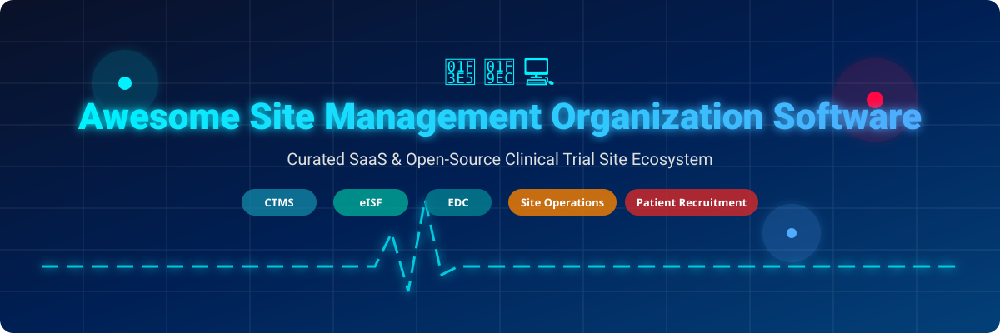

# 🏥 Awesome Site Management Organization Software 🧬

    

> **A curated, SEO-optimized list of top SaaS platforms and open-source GitHub projects for Site Management Organizations (SMOs), Clinical Research Sites, Site Networks, and Academic Medical Centers.**

*Focused on Clinical Trial Management Systems (CTMS), Electronic Investigator Site Files (eISF / eBinders), Electronic Data Capture (EDC), Regulatory Document Management, Patient Recruitment, Visit Tracking, and Site Financial Operations.*

**Last updated: September 2026** 📅

---

## 📌 Executive Overview & Ecosystem Insights

Clinical research site operations rely heavily on validated software ecosystems to manage protocols, participant visits, regulatory binders, budgeting, and sponsor compliance (ICH-GCP, 21 CFR Part 11, HIPAA, GDPR).

- **Commercial SaaS Platforms**: Predominantly dominate enterprise site networks, academic health centers, and commercial SMOs requiring out-of-the-box regulatory validation, 24/7 support, and sponsor integration.
- **Open-Source Software**: Essential for academic research teams, custom institutional infrastructure, and developer teams seeking modular foundations for Electronic Data Capture (EDC), trial registry management, and quality control.

---

## 📚 Table of Contents

- [🏢 SaaS & Hosted Platforms](#-saas--hosted-platforms)
- [💻 Open-Source GitHub Projects](#-open-source-github-projects)
- [📈 Star History](#-star-history)
- [🤝 How to Contribute](#-how-to-contribute)
- [⚖️ Disclaimer](#%EF%B8%8F-disclaimer)

---

## 🏢 SaaS & Hosted Platforms

> 💡 **Market Size & Industry Structure**: The global Clinical Trial Management System (CTMS) and site operations software market is estimated at **$1.8 Billion – $2.5 Billion** (projected to reach over **$5.0 Billion** by 2032 at a CAGR of ~14.5%). The sector is **moderately fragmented** at the site level—enterprise leaders like Veeva and Advarra command large academic and sponsor institutional networks, while specialized SaaS providers (Florence, RealTime, CRIO, SimpleTrials) compete aggressively for independent site networks, SMOs, and private research clinics, creating a vibrant, multi-tiered market rather than a winner-take-all monopoly.

*The table below compares top commercial SaaS platforms, ordered by company size (valuation / annual revenue) descending:*

| Platform / Product | Description | Company Valuation / Revenue | Specific Starting Pricing | Free Tier / Free Trial Limits |
| :--- | :--- | :--- | :--- | :--- |
| **[Veeva SiteVault](https://sites.veeva.com/)** 🏥 | Site-centric platform including eISF, SiteVault CTMS, eConsent, and eSource connected to the Veeva clinical ecosystem. | **~$45.0B Market Cap** (~$2.6B Annual Revenue, NYSE: VEEV) | $0/month for SiteVault Free tier (Enterprise edition starts at $10,000/year for >20 active studies) | Free forever plan available for sites managing up to 20 concurrent active studies (unlimited users & storage) |
| **[Clinical Conductor / Advarra CTMS](https://www.advarra.com/)** 💼 | Site- and academic-focused CTMS solutions (Clinical Conductor & OnCore) for protocol management, subjects, staffing, and financials. | **~$5.0B Valuation** (~$400M+ Annual Revenue, PE-backed: Blackstone & Genstar) | Starts at $25/user/month (or $1,000/month site license starting tier) | No free plan; provides a 14-day evaluation demo sandbox upon request |
| **[Trial Interactive](https://www.trialinteractive.com/)** 📑 | Enterprise eClinical platform by TransPerfect covering eTMF, CTMS, site document management, and regulatory workflows. | **~$2.0B+ Parent Valuation** (~$1.32B TransPerfect Group Revenue) | Starts at $1,500/month (or $18,000/year base tier for site document management) | No free plan or free trial; provides 30-day sandbox demo access for evaluating sites |
| **[Florence eBinders](https://www.florencehc.com/)** 📂 | Leading electronic investigator site file (eISF) and eRegulatory platform for document management and inspection readiness. | **~$300M–$500M Valuation** (~$30M–$50M Est. Revenue, Backed by Insight Partners) | Starts at $1,200/study setup (plus ~$100/month maintenance fee for industry studies) | No free plan or free trial; provides interactive guided product demos upon request |
| **[RealTime CTMS](https://realtime-ctms.com/)** ⏱️ | Clinical trial management system built specifically for research sites and networks, covering recruitment, scheduling, and financials. | **~$200M–$300M Valuation** (~$25M–$40M Est. Revenue, PE-backed: Luminate Capital) | Starts at $500/month for core site operations tier | No free plan or free trial; offers live interactive product demos upon request |
| **[Complion](https://www.complion.com/)** 🛡️ | eRegulatory and compliance platform focused on investigator site file management, audit readiness, and regulatory workflows. | **~$200M–$300M Parent Valuation** (Acquired by RealTime Software Solutions) | Starts at $500/month (or bundled with RealTime eClinical suite) | No free plan or free trial; provides interactive guided product demos upon request |
| **[CRIO (Clinical Research IO)](https://clinicalresearch.io/)** 🔬 | Integrated eSource, eRegulatory, and CTMS platform for site data capture, patient stipend management, and study workflows. | **~$100M–$150M Valuation** (~$15M–$25M Est. Revenue, Series B Venture Backed) | Starts at $200/month (per base module starting tier) | No free plan or free trial; provides guided interactive site demos upon request |
| **[SimpleTrials](https://www.simpletrials.com/)** 🚀 | Accessible subscription-based CTMS designed for smaller research organizations and sites needing core study management. | **~$30M–$50M Est. Valuation** (~$5M–$10M Est. Revenue, Privately Held) | Starts at $599/month (Standard subscription plan, month-to-month) | No free forever plan; offers a 30-day "Test Drive" evaluation environment for a $49 one-time fee |
| **[EDGE CTMS](https://edgeclinical.com/)** 🇬🇧 | Research management platform used by clinical research networks and NHS sites for participant tracking and trial administration. | **~$200M NHS / Network Reach** (~$3M–$8M Est. Software Unit Revenue) | Starts at £1,000/year (~$1,300/year base tier) | No free plan; provides access to a pre-configured DEMO sandbox environment for site testing |

---

## 💻 Open-Source GitHub Projects

*High-quality open-source tools for clinical research data capture, CTMS, eCRF, and regulatory compliance. Listed in descending order of GitHub stargazers:*

1. **[openemr/openemr](https://github.com/openemr/openemr)**  🩺  
   Widely adopted open-source EHR and practice management system adapted by research sites for participant scheduling, clinical documentation, and trial patient management.

2. **[OpenClinica/OpenClinica](https://github.com/OpenClinica/OpenClinica)**  📊  
   Pioneer open-source clinical data management and Electronic Data Capture (EDC) system for multi-center clinical trials and academic studies.

3. **[OHDSI/Atlas](https://github.com/OHDSI/Atlas)**  🌐  
   Open-source web platform for clinical research cohort definition, observational health data analytics, and trial feasibility analysis across OMOP CDM databases.

4. **[redcap-tools/pycap](https://github.com/redcap-tools/pycap)**  🐍  
   Python API interface for REDCap, enabling automated clinical trial data extraction, participant management, and eCRF data synchronization.

5. **[phoenixctms/ctsms](https://github.com/phoenixctms/ctsms)**  🦅  
   Comprehensive open-source CTMS/PRS/CDMS platform combining patient recruitment, clinical trial management, and clinical data management for hospitals and CROs.

6. **[reliatec-gmbh/LibreClinica](https://github.com/reliatec-gmbh/LibreClinica)**  🔓  
   Community-driven open-source clinical research EDC platform descended from OpenClinica 3.x with updated compliance and security standards.

7. **[clinicedc/edc](https://github.com/clinicedc/edc)**  ⚡  
   Django-based open-source framework for building multisite longitudinal clinical trial data management, eSource, and eCRF systems.

8. **[MeyerThorsten/QAtrial](https://github.com/MeyerThorsten/QAtrial)**  🛡️  
   Open-source quality and regulated-workspace platform featuring eTMF, eConsent, CAPA, and GxP compliance tools for clinical research quality workflows.

9. **[ecs-org/ecs](https://github.com/ecs-org/ecs)**  📜  
   Open-source system supporting institutional Ethics Committee workflows, clinical trial protocol submissions, and regulatory approval tracking.

---

## 📈 Star History

---

## 🤝 How to Contribute

Contributions are welcome! Help us keep this clinical research software directory comprehensive and up to date. 🌟

1. **Fork** the repository.
2. Add or edit entries in `README.md` following the tabular and list formatting.
3. Include: Product name, official link, brief description, company valuation/revenue or star count badge, and pricing/trial limits.
4. Submit a **Pull Request** with a clear summary of your updates.

---

## ⚖️ Disclaimer

- This list is **community-curated** for educational and informational purposes — it does not constitute endorsement.
- Clinical research systems process Protected Health Information (PHI) and personally identifiable data; deployments must comply with regulatory requirements including **ICH-GCP**, **21 CFR Part 11**, **HIPAA**, and **GDPR**.
- Open-source software does not inherently guarantee regulatory compliance; deployment sites are responsible for validation, audit trails, and security controls.

---

**Made with ❤️ for Clinical Research Site Teams, SMOs, Principal Investigators, Clinical Operations Leads, and Health Informatics Specialists.**
